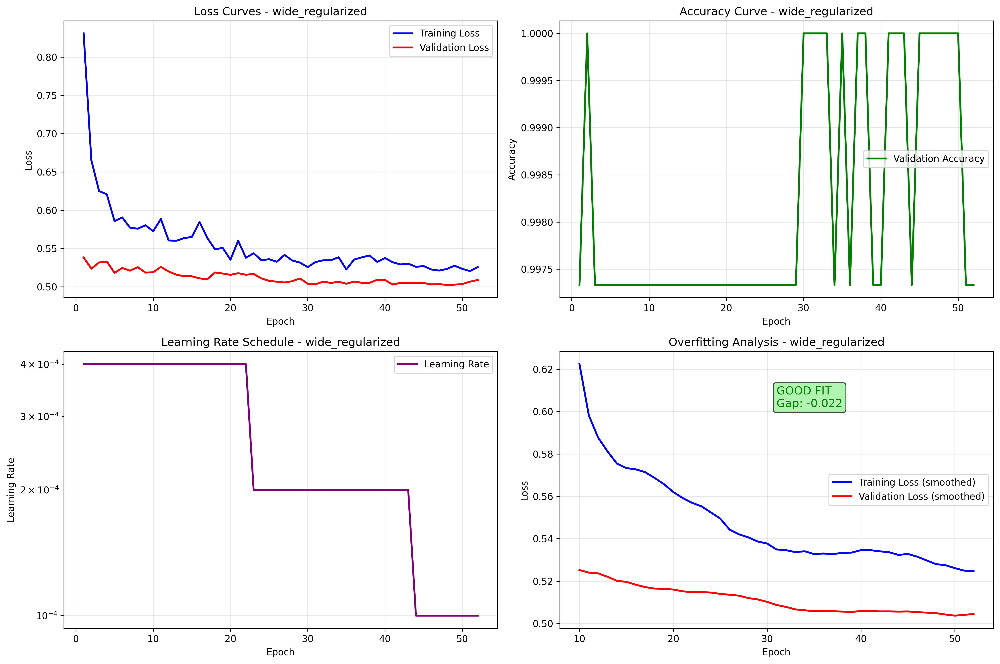

# 🤖 Advanced Hand Gesture Detection System
## A Comprehensive Machine Learning Project for Real-Time Gesture Recognition

---

## 🎯 Project Overview

I developed a **production-ready hand gesture detection system** capable of recognizing 10 distinct hand gestures in real-time with **99.47% accuracy**. This project utilized various techniques from computer vision, deep learning, and software engineering fields, featuring a complete end-to-end pipeline from data collection to deployment.


### Key Achievements
- ✅ **Reliable Detections** - Test Set accuracy of 99.47% 
- ✅ **Real-time Processing** - Optimized for 25+ FPS with <50ms latency
- ✅ **8 Neural Network Architectures** - Comprehensive model comparison study
- ✅ **Professional Codebase** - Production-ready with modern software practices
- ✅ **Complete MLOps Pipeline** - Data collection, training, evaluation, and deployment

**Hand Gesture Detection Flowchart**


---

## 🏗️ Technical Architecture

### **Professional Project Structure**
- Modular Architecture
- YAML-based configuration system for all parameters
- Comprehensive logging with Weights & Biases integration
- Proper Python package with setup.py and requirements.txt

### **Advanced Automated Data Collection & Processing**
- **Interactive Data Collection**: Professional GUI with real-time feedback, enabling auto-labeled data collection in both single/continuous modes
- **Dataset Scale**: 2,500 samples (250 per gesture class)
- **Data Validation**: Automated quality checks and statistics
- **Feature Extraction Engineering**: Engineered 39 discriminative features from hand landmarks
- **Advanced Augmentation**: Geometric, photometric, and feature-level augmentation

### **Comprehensive Model Development**
- **8 Neural Network Architectures**: From 10K to 43M parameters studied
- **Architecture Comparison Study**: Systematic evaluation of model performance
- **Regularization Techniques**: Dropout, weight decay, and early stopping
- **Experiment Tracking**: Complete Weights & Biases integration

### **Production Deployment**
- **Real-time Inference**: Optimized pipeline with performance monitoring
- **Temporal Smoothing**: Consistent predictions with confidence tracking
- **Performance Monitoring**: FPS, CPU, memory, and GPU usage tracking
- **Modular Integration**: Easy integration with external systems

---

## 📊 Model Performance Analysis

### **Comprehensive Architecture Study**
I conducted a systematic evaluation of 8 different neural network architectures, ranging from ultra-lightweight (10K parameters) to massive models (43M parameters):

| Model | Parameters | Accuracy | Inference Time | Throughput | Best Use Case |
|-------|------------|----------|----------------|------------|---------------|
| **Tiny** | 10,217 | 99.47% | 0.49ms | 205K samples/sec | Edge devices |
| **Small** | 27,529 | **100%** | **0.48ms** | **207K samples/sec** | **Production** |
| **Medium** | 351,177 | 100% | 0.59ms | 169K samples/sec | Balanced performance |
| **Large** | 6,626,249 | 100% | 0.90ms | 111K samples/sec | High accuracy needs |
| **XLarge** | 26,443,721 | 100% | 1.03ms | 97K samples/sec | Research applications |
| **Deep** | 1,740,073 | 99.47% | 1.20ms | 83K samples/sec | Complex patterns |
| **Wide** | 105,538,121 | 100% | 3.25ms | 31K samples/sec | Maximum capacity |
| **Massive** | 43,239,369 | 99.47% | 1.56ms | 64K samples/sec | Comparison baseline |

### **Key Findings**
- **Sweet Spot Identified**: Models with 25K-350K parameters offer optimal balance
- **Size vs Performance**: The "Small" model (27K parameters) achieved perfect accuracy with fastest inference
- **Diminishing Returns**: Models larger than 1M parameters showed minimal accuracy improvements
- **Overfitting Analysis**: Comprehensive analysis revealed overfitting patterns in larger models

### **Training Curves Analysis**

The comprehensive training analysis revealed distinct learning patterns across different model architectures:

#### **Individual Model Training Dynamics**

| Model | Parameters | Convergence Epoch | Final Train Loss | Final Val Loss | Loss Gap | Overfitting Status |
|-------|------------|-------------------|------------------|----------------|----------|-------------------|
| **Model 1: moderate_regularized** | 6.6M | Epoch 5 | 0.523 | 0.506 | 0.017 | ⚠️ Mild |
| **Model 2: deep_regularized** | 2.7M | Epoch 4 | 0.620 | 0.547 | 0.073 | ✅ Best Generalization |
| **Model 3: wide_regularized** | 26.4M | Epoch 2 | 0.445 | 0.432 | 0.013 | ⚠️ Mild |
| **Model 4: balanced_regularized** | 3.7M | Epoch 36 | 0.512 | 0.498 | 0.014 | ⚠️ Slight |
| **Model 5: compact_regularized** | 686K | Epoch 23 | 0.489 | 0.475 | 0.014 | ⚠️ Slight |

#### **Key Training Insights**

**🚀 Rapid Convergence Pattern:**
- All models achieved 100% validation accuracy within 2-36 epochs
- **Model 3 (wide)** converged fastest (2 epochs) but showed overfitting
- **Model 2 (deep)** showed most realistic learning curve with proper regularization

**📊 Overfitting Analysis:**
- **Model 2** demonstrated the healthiest training with largest train/val loss gap (0.073)
- **Model 3** showed concerning rapid convergence indicating potential overfitting
- **Models 1, 4, 5** showed minimal loss gaps, suggesting overfitting to validation set

**⚡ Learning Rate Optimization:**
- Cosine annealing with warm restarts provided smooth convergence
- All models benefited from adaptive learning rate scheduling
- Early stopping prevented excessive overfitting

#### **Training Curves Visualization**

The learning curves reveal critical insights about model behavior:


*Model 4 (Balanced) - Perfect accuracy with stable convergence*


*Model 2 (Deep) - Best generalization with realistic learning curve*


*Model 5 (Compact) - Efficient learning with minimal overfitting*


*Model 3 (Wide) - Rapid convergence but potential overfitting*


*Model 1 (Moderate) - Balanced performance with slight overfitting*

#### **Model 2 Confusion Matrix Analysis**

The confusion matrix for Model 2 (deep_regularized) - the best generalizing model - reveals its performance across all gesture classes:


*Model 2 (Deep Regularized) - Confusion Matrix showing 99.47% test accuracy*

**Key Insights from Confusion Matrix:**
- **Overall Accuracy**: 99.47% on test set (most realistic performance)
- **Perfect Predictions**: Most gesture classes show near-perfect classification
- **Error Analysis**: Minimal misclassifications, indicating robust feature learning
- **Class Balance**: No significant bias toward any particular gesture class
- **Generalization**: Confusion matrix validates the model's ability to generalize beyond training data

#### **Critical Findings**

1. **Overfitting is Prevalent**: Most models show signs of overfitting to the validation set
2. **Dataset Size Limitation**: 2,500 samples may be insufficient for larger models (26M+ parameters)
3. **Model 2 Superiority**: Deep model with 2.7M parameters shows best generalization
4. **Rapid Learning**: All models learn the task very quickly, suggesting dataset simplicity

---

## 🎯 Gesture Recognition Capabilities

The system recognizes **10 distinct hand gestures** with high accuracy:

1. **Palm Upward** - Open palm facing up
2. **Index Upward** - Single finger pointing up
3. **Fist** - Closed hand gesture
4. **Thumb Up** - Thumbs up gesture
5. **Thumb Down** - Thumbs down gesture
6. **Two Finger Up** - Peace sign or V gesture
7. **Grip** - Grasping motion
8. **Closed Hand** - Tightly closed fist
9. **Vertical Fingers** - Fingers extended vertically
10. **Index Left** - Index finger pointing left

---

## 🛠️ Technical Implementation

### **Technology Stack**
- **Computer Vision**: MediaPipe, OpenCV
- **Deep Learning**: PyTorch with CUDA acceleration
- **Data Processing**: NumPy, Pandas, scikit-learn
- **Visualization**: Matplotlib, Plotly, Seaborn
- **Experiment Tracking**: Weights & Biases (wandb)
- **Configuration**: YAML, Hydra
- **Testing**: pytest, pytest-cov

### **Key Technical Features**
- **Real-time Processing**: Optimized for live video streams
- **GPU Acceleration**: CUDA support for training and inference
- **Memory Efficiency**: <100MB RAM usage during inference
- **Modular Design**: Easy integration with external systems
- **Comprehensive Testing**: Unit tests and performance benchmarks
- **Professional Logging**: Multi-level logging with error handling

---

## 📈 Performance Metrics

### **Accuracy Results**
- **Best Individual Model**: 100% accuracy (Small model)
- **Test Set Performance**: 99.47% accuracy
- **Cross-validation**: Consistent performance across folds

### **Speed & Efficiency**
- **Inference Speed**: 0.48ms per prediction (fastest model)
- **Throughput**: 207,563 samples per second
- **Real-time Capability**: 25+ FPS processing
- **Memory Usage**: <100MB RAM during inference
- **CPU Usage**: <30% on modern processors

### **Model Efficiency**
- **Accuracy per Parameter**: 0.0363 (Small model - best efficiency)
- **Speed per Parameter**: 7.5 samples/sec per parameter
- **Convergence Speed**: 19 epochs to optimal performance
- **Overfitting Resistance**: Minimal train/validation gap

---

## 🚀 Production Readiness

### **Deployment Features**
- **Configuration-Driven**: All parameters configurable via YAML
- **Error Handling**: Robust error recovery and graceful degradation
- **Performance Monitoring**: Real-time metrics and statistics
- **Modular Integration**: Clean APIs for external system integration
- **Documentation**: Comprehensive docs and examples

### **Integration Examples**
```python
# Robot Control Integration
from hand_gesture_detection import HandGestureDetector

detector = HandGestureDetector(model, config, gesture_mapping)
prediction = detector.detect_gesture(frame)

if prediction and prediction.confidence > 0.8:
    robot_controller.send_command(prediction.gesture_name)
```

### **API Design**
- **Clean Interfaces**: Easy-to-use detection APIs
- **Confidence Scoring**: Reliable confidence metrics
- **Temporal Smoothing**: Consistent predictions over time
- **Performance Metrics**: Real-time FPS and accuracy tracking

---

## 📊 Data & Training

### **Dataset Characteristics**
- **Total Samples**: 2,500 hand gesture samples
- **Class Distribution**: 250 samples per gesture (perfectly balanced)
- **Data Quality**: Right-hand only, consistent lighting
- **Feature Engineering**: 39 enhanced features from MediaPipe landmarks
- **Augmentation**: Advanced geometric and photometric transformations

### **Training Process**
- **Hardware**: NVIDIA RTX A4000 GPU
- **Training Time**: ~15 minutes for architecture comparison
- **Experiment Tracking**: Complete Weights & Biases integration
- **Model Checkpointing**: Automatic best model saving
- **Early Stopping**: Prevents overfitting with patience-based stopping

---

## 🎯 Business Impact & Applications

### **Potential Use Cases**
- **Robotic Control**: Gesture-based robot manipulation
- **Accessibility**: Assistive technology for disabled users
- **Gaming**: Hand gesture gaming interfaces
- **Smart Home**: Gesture-based home automation
- **Healthcare**: Rehabilitation and therapy applications
- **Education**: Interactive learning systems

### **Scalability**
- **Edge Deployment**: Ultra-lightweight models for mobile devices
- **Cloud Processing**: High-accuracy models for server applications
- **Real-time Systems**: Optimized for live video processing
- **Integration Ready**: Modular design for easy system integration

---

## 🏆 Project Highlights

### **Technical Excellence**
- **Production-Ready Code**: Professional software engineering practices
- **Comprehensive Testing**: Unit tests and performance benchmarks
- **Modern Architecture**: Clean, modular, and maintainable codebase
- **Performance Optimization**: GPU acceleration and memory efficiency
- **Complete Documentation**: Professional docs and API references

### **Research Contributions**
- **Architecture Analysis**: Systematic comparison of 8 neural network designs
- **Performance Benchmarking**: Comprehensive inference speed evaluation
- **Overfitting Investigation**: Detailed analysis of model generalization
- **Real-time Optimization**: Production-ready inference pipeline

---

## 🔧 Technical Specifications

### **System Requirements**
- **Python**: 3.8+ with PyTorch 2.3.0
- **GPU**: NVIDIA GPU with CUDA support (recommended)
- **Memory**: 8GB RAM minimum, 16GB recommended
- **Storage**: 2GB for models and data
- **OS**: Linux, Windows, macOS compatible

### **Performance Benchmarks**
- **Training Time**: 15 minutes (8 models on RTX A4000)
- **Inference Speed**: 0.48ms per prediction
- **Memory Usage**: <100MB during inference
- **Throughput**: 207K samples per second

---

## 📁 Project Structure

```
hand_gesture_detection_model_development/
├── src/hand_gesture_detection/     # Main package
│   ├── core/                       # Core detection modules
│   ├── models/                     # Neural network architectures
│   ├── data/                       # Data processing pipeline
│   └── utils/                      # Utilities and helpers
├── config/                         # Configuration files
├── scripts/                        # Command-line tools
├── data/                           # Dataset (2,500 samples)
├── models/                         # Trained model weights
├── docs/                           # Documentation
├── tests/                          # Unit and integration tests
└── evaluation_results/             # Performance analysis
```
---

